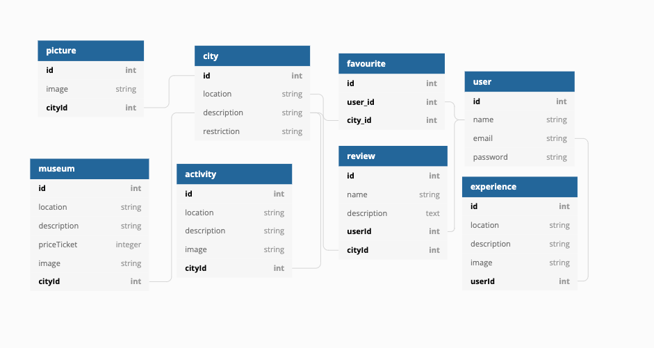

<h1>Where should I go? It is a travel game that decide your next destination!</h1>
 

This is a group project made by 3 junior developers and in only 5 days of Codaisseur Bootcamp we create a travel game app!

This game consist in a wheel fortune game that decide your next travel destination randomly.
Than you can find more details information about this destination, like weather for the next 10 days(YahooAPI),restaurants, attractions and hotels(RapidAPI).

<h1>Database Tables:</h1>

  

<h1>For this app we used:</h1>
 
Languages: Javascript
 
Frontend Libraries: React - Redux - Axios
 
Backend: Node - Express - Sequelize
 
Database: Postgres

    
  
  
  
  
  

<h1>Best Features:</h1>
 
1. Create a wheel of fortune game where a random destination is pick for you!
 
2. Upload personal experience on the app!

<h1>Website:</h1>
  https://superb-cheesecake-edf39a.netlify.app/

<h1>Login for play the game:</h1>

 As a user: email: a@a.com pass: a.

 

